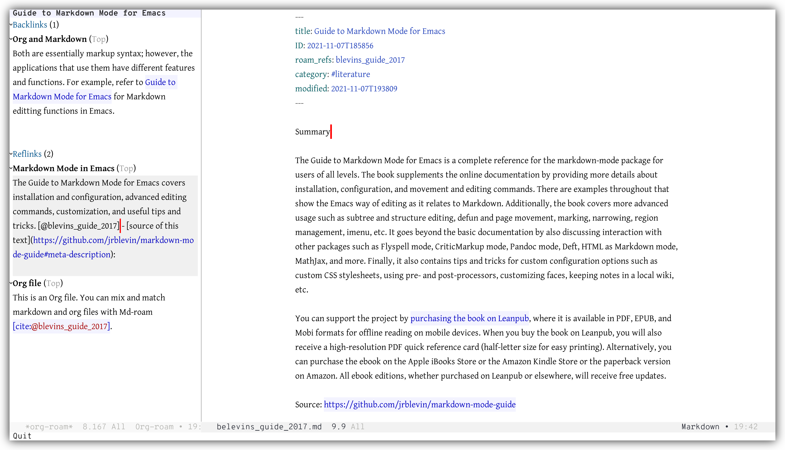

[![License GPL 3][badge-license]](http://www.gnu.org/licenses/gpl-3.0.txt)

# Synopsis

Use Org-roam with markdown files by adding Md-roam to it.
Md-roam extends the features and functions provided by [Org-roam](https://www.orgroam.com/) to support markdown files in addition to org files.

1. Title and other meta data in the YAML front matter
2. #tag support to categorize notes
3. Specify notes for a reference material (literature notes / bibliographic notes) with `roam_refs:`
4. Aliases of a note with `roam_aliases:`
5. Link for backlinks with [[wiki-link]] syntax
6. Citation with Pandoc style [@citekey], @citekey -@citekey, etc.
7. Org-roam standard backlink buffer with Org mode (no modification to the database and backlink buffer)

# License

Md-Roam: Copyright © Noboru Ota

Org-Roam: Copyright © Jethro Kuan and contributors.
Distributed under the GNU General Public License, Version 3

[org]: https://orgmode.org/
[badge-license]: https://img.shields.io/badge/license-GPL_3-green.svg
[docs]: https://org-roam.github.io/org-roam/manual/
[slack]: https://join.slack.com/t/orgroam/shared_invite/zt-deoqamys-043YQ~s5Tay3iJ5QRI~Lxg
[discourse]: https://org-roam.discourse.group/
