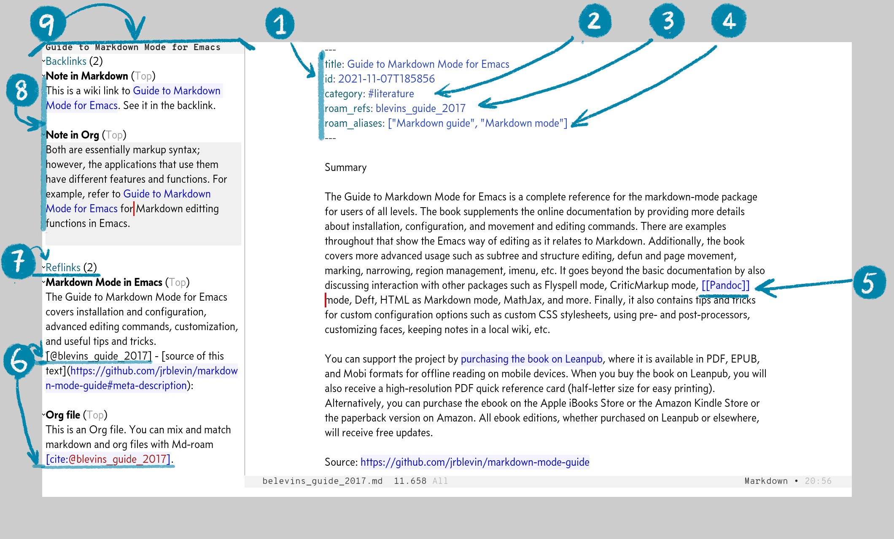

[![License GPL 3][badge-license]](http://www.gnu.org/licenses/gpl-3.0.txt)

Use [Org-roam](https://www.orgroam.com/) with Markdown files by adding Md-roam
to it.  Md-roam extends the features and functions provided by Org-roam to
support Markdown files. Mix Markdown with Org files in a single Org-roam database
for your Zettelkasten-style note-taking and backlinks.



1. Title and other meta data in the YAML front matter

2. `#tag` support to categorize notes

3. Note as a reference material (literature notes or notes on website) with `roam_refs:`

4. Aliases of a note with `roam_aliases:` in the YAML array syntax with `["alias1", "alias two"]`

5. Link with `[[wiki-link]]` syntax that appears as a backlink and "in-line search" with `Company` or `Corfu`; you can use the **title** or an **alias** of a note

6. Citations with Pandoc style `[@citekey]`, `@citekey` `-@citekey`, etc. for Markdown files; for Org, Org-ref or Org-cite styles as Org-roam support them

7. Markdown and Org citations for reference materials; they appear in the reflink section

8. Backlinks between Org and Markdown files both ways; you can mix both formats in a single Org-roam database

9. Org-roam standard backlink buffer with no modification to the database schema and backlink buffer

# Getting Started

## Installation

This package is not available on MELPA or ELPA. Manual installation is required.

Download or clone this repo, put the `.el` file into your load-path, and put
something like this in your init file.

```emacs-lisp
(add-to-list  'load-path "path/to/org-transclusion/")
```

## Basic Configuration

Org-roam must be configured before Md-roam. As a minimal configuration for Md-roam, these should be sufficient:

- `(setq org-roam-file-extensions '("org" "md")) ; enable Org-roam for a markdown extension`
- `(md-roam-mode 1) ; md-roam-mode needs to be active before org-roam-db-sync`
- `(setq md-roam-file-extension-single "md") ; Default is "md". Specify an extension such as "markdown"`

```emacs-lisp
(setq org-roam-v2-ack t)
(require 'org-roam)
(setq org-roam-directory (file-truename "path/to/org-roam-directory"))
(setq org-roam-file-extensions '("org" "md")) ; enable Org-roam for a markdown extension
(add-to-list 'load-path "path/to/md-roam/")
(require 'md-roam)
(md-roam-mode 1) ; md-roam-mode needs to be active before org-roam-db-sync
(setq md-roam-file-extension-single "md") ; Default is "md". Specify an extension such as "markdown"
(org-roam-db-autosync-mode 1) ; Org-roam db autosync-mode
```

Additionally, you can use `org-roam-capture-templates` for Markdown files like this:

```emacs-lisp
(add-to-list 'org-roam-capture-templates
    '("m" "Markdown" plain "" :target
        (file+head "%<%Y-%m-%dT%H%M%S>.md"
"---\ntitle: ${title}\nid: %<%Y-%m-%dT%H%M%S>\ncategory: \n---\n")
    :unnarrowed t))
```

For interactive commands, you can use the Org-roam's standard ones. There is no specific commands for Md-roam:

```emacs-lisp
;;;; Org-roam
(define-key global-map (kbd "C-c n f") #'org-roam-node-find)
(define-key global-map (kbd "C-c n c") #'org-roam-capture)
(define-key global-map (kbd "C-c n i") #'org-roam-node-insert)
(define-key global-map (kbd "C-c n l") #'org-roam-buffer-toggle)
```

## "In-line search" with Company and Corfu

For [Company](https://github.com/company-mode/company-mode), there is no specific configuration. Md-roam implements `completion-at-point` (or `capf`); use it as a Company backend. For more detail, refer to Company's documentation.

For [Corfu](https://github.com/minad/corfu), add something like this below to get <kbd>Tab</kbd> to work for `corfu-mode`. Markdown-mode implements a function that does not let <kbd>Tab</kbd> use `complete-at-point` like Org-mode does.

```emacs-lisp
(with-eval-after-load 'markdown-mode
  (advice-add #'markdown-indent-line :before-until #'completion-at-point))
```

# License

Md-Roam: Copyright © Noboru Ota
Org-Roam: Copyright © Jethro Kuan and contributors.

Distributed under the GNU General Public License, Version 3

[org]: https://orgmode.org/
[badge-license]: https://img.shields.io/badge/license-GPL_3-green.svg
[docs]: https://org-roam.github.io/org-roam/manual/
[slack]: https://join.slack.com/t/orgroam/shared_invite/zt-deoqamys-043YQ~s5Tay3iJ5QRI~Lxg
[discourse]: https://org-roam.discourse.group/
