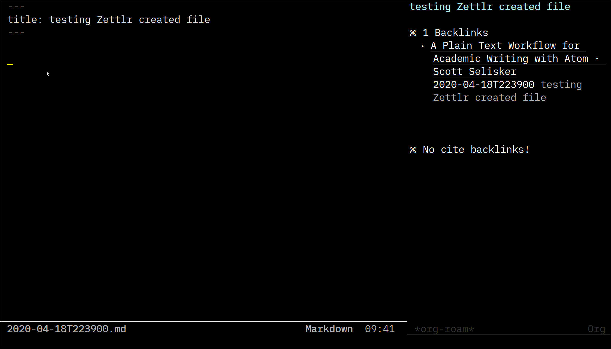
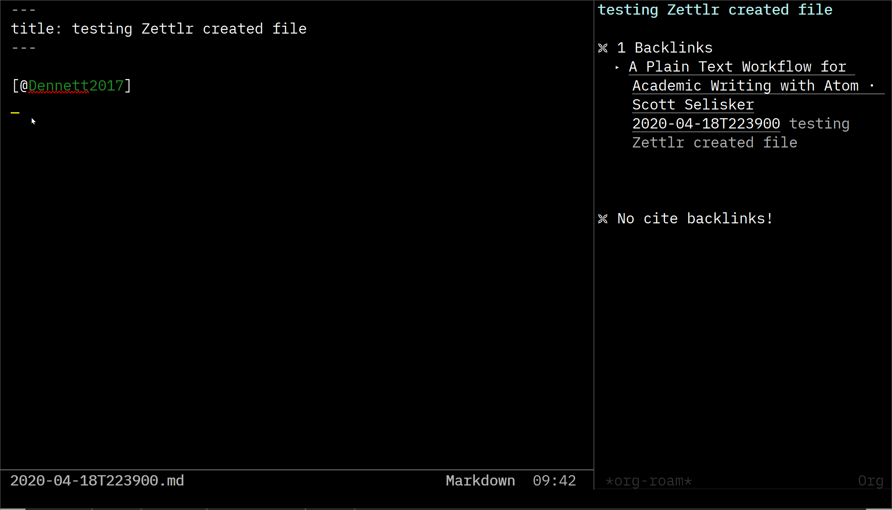

[![License GPL 3][badge-license]](http://www.gnu.org/licenses/gpl-3.0.txt)

## Synopsis

Use `org-roam` with markdown files by adding `md-roam` to it.
`md-roam` extends the features and functions provided by [`org-roam`](https://github.com/jethrokuan/org-roam) to support markdown files in addition to org files. 






---

`md-roam` currently supports the following features:

- Customize the markdown extension you use.

   You can define the markdown extension of your choice such as `.md` or `.markdown`.
   
- `title: Note's Title` in the YAML frontrunner delineated by `---`

  Currently no support for TOML or MMD syntax
  
- Backlink for the `[[wiki-link]]` syntax

- `org-roam-insert` to insert `[[filename-without-extension]]` to create backlinks. 

- pandoc style citation for cite links, such as `[@bibkey]`, `@bibkey` `-@bibkey`
  
I have been trying to closely trail the upstream `org-roam` development; nevertheless, as it is being actively developed (awesome!), `md-roam` is usually lagging a bit behind. As of 2020-05-02, I am using it with upstream version 1.1 at commit [`0132546`](https://github.com/jethrokuan/org-roam/commit/0132546e56eb5cffd6cc52177b6ffbeab0d84743) (latest as at the time of writing this).

Please note, however, that Jethro and contributors have added good many new features since my last sync (on 2020-04-26). Among them, I see the following ones potentially relevant for =md-roam=. They might (or might not) interfere with =md-roam=. So far, I haven't tried them on yet. I will try to see if I can allocate some time to do some (light) tests. 

If anyone has some spare time, I would appreciate your helping with testing. I'll be happy to have comments logged in issues in GitHub (it seems people are more comfortable with it than GitLab) -- I'll try to make explicit and community-friendly how we can use issues etc. as communication channels. 

* TODO check multi cite [#545](https://github.com/jethrokuan/org-roam/pull/545)
* TODO check org-roam-title-include-subdirs [#427](https://github.com/jethrokuan/org-roam/pull/427)
* TODO check (feat): optionally use headline as title [#538](https://github.com/jethrokuan/org-roam/pull/538)


The standard `org-roam` features are [should be] still supported. This means you can use `org` file together with `md` files, or use the standard `org-roam` related `org` syntax in your `.md` files, such as:

- `#+TILTLE: org title`

- `[[file:linked-file.org][Note's Title]]`

- (hopefully `org-ref`) -- not tested as I don't use it

## Installation

`md-roam` is a "plug-in" for `org-roam`. You need to get `org-roam` working first. Add `md-roam`, and load or require it before `org-roam`. `md-roam` does not change any part of source code of `org-roam`.

I don't intend it to be available in MELPA at the moment; I have never done it.

You can download `md-roam.el` file, or clone this repository. Place the file in somewhere `load-path` recognizes, and configure like the following.


```
(add-to-list 'load-path "~/path/to/md-roam-directory/") ;Modify with your own path

(require 'md-roam) ;this must be before org-roam

(setq md-roam-file-extension-single "md") 
  ;set your markdown extension
  ;you can omit this if md, which is the default.
```

You also need to add your markdown extension to `org-roam-file-extensions` list -- this is for `org-roam` to know that you use the extension with `org-roam`.

```
(setq org-roam-file-extensions '("org" "md"))
```


I use [Doom Emacs](https://github.com/hlissner/doom-emacs/blob/develop/docs/getting_started.org#installing-packages-from-external-sources).
With it, you can use GitLab, GitHub (mirrored), or clone this repo to your local, and add respective one of these below. Don't forget to `doom sync`.

```
;in your package.el

(package! md-roam
  :recipe (:gitlab
  :repo "nobiot/md-roam"))
```

```
;in your package.el

(package! md-roam
  :recipe (:github
  :repo "nobiot/md-roam"))
```

```
;in your package.el

(package! md-roam
  :recipe (:local-repo "path/to/your-local-repos/md-roam"))
```

Add the following config in your `config.el`

```
;in your config.el

(use-package! md-roam ; load immediately, before org-roam
  :config
  (setq md-roam-file-extension-single "md")) 
    ;you can omit this if md, which is the default.
```


## Org-Roam

`md-roam` is an unofficial plug-in for `org-roam`. For more information on `org-roam`, refer to [the `org-roam`
documentation](https://org-roam.readthedocs.io/en/master/installation/). 

It has installation and configuration instructions (including installation guide for Windows users, and Doom and Spacemacs configurations). 

## Knowledge Bases using Org-roam

- [Jethro Kuan](https://braindump.jethro.dev/)
  ([Source](https://github.com/jethrokuan/braindump/tree/master/org))

## Changelog

A changelog is being maintained [here](CHANGELOG.md)

## License

Md-Roam: Copyright © Noboru Ota
Org-Roam: Copyright © Jethro Kuan and contributors. 
Distributed under the GNU General Public License, Version 3

[roamresearch]: https://www.roamresearch.com/
[org]: https://orgmode.org/
[badge-license]: https://img.shields.io/badge/license-GPL_3-green.svg
[docs]: https://org-roam.readthedocs.io/
[slack]: https://join.slack.com/t/orgroam/shared_invite/zt-deoqamys-043YQ~s5Tay3iJ5QRI~Lxg
