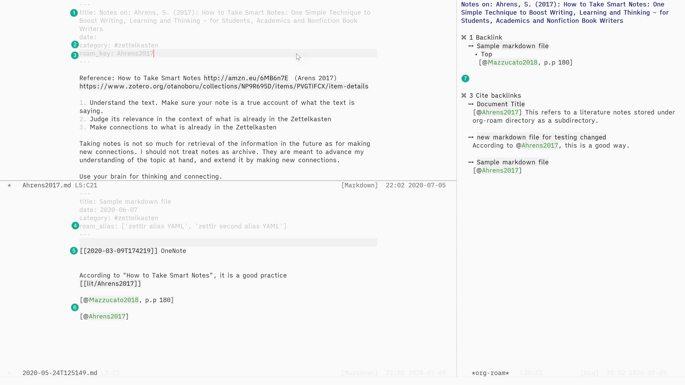

[![License GPL 3][badge-license]](http://www.gnu.org/licenses/gpl-3.0.txt)


## Synopsis

Use Org-roam with markdown files by adding Md-roam to it.
Md-roam extends the features and functions provided by [Org-roam](https://www.orgroam.com/) to support markdown files in addition to org files. 



1. Title and other meta data in the YAML front matter
2. #tag support to categorize notes
3. Specify notes for a reference material (literature notes / bibliographic notes) with `roam_key:` 
4. Aliases of a note with `roam_alias:`
5. Link for backlinks with [wiki-link] syntax
6. Citation with Pandoc style [@citekey], @citekey -@citekey, etc.
7. Org-roam standard backlink buffer with Org mode (no modification to the database and backlink buffer)

---

## Change Log

Upstream Org-roam is going through many changes. To catch up, Md-roam is also changing heavily. I suggest to refer to Changelog maintained [here](CHANGELOG.md) for some breaking changes. Nothing should break your notes as Org-roam is not designed to alter them, but it is a good practice to keep a backup of your notes, and the org-roam database file (usually named `org-roam.db` stored in your `org-roam-directory`).

## Features of Org Roam Supported

v1.4 is out with support for additional Org-roam features and optional configuration for performance improvement. Find more about it in [this document](./docs/v1.4.md). 

Md-roam currently supports the following features for your markdown notes:

- Customize the markdown extension you use.

   You can define the markdown extension of your choice such as `.md` or `.markdown`.
   
- `title: Note's Title` in the YAML front matter at the top of the markdown note delineated by `---`

   Currently no support for TOML or MMD syntax

- Backlink for the `[[wiki-link]]` syntax

- `org-roam-insert` to insert `[[filename-without-extension]]` to create backlinks. 

- pandoc style citation for cite links, such as `[@bibkey]`, `@bibkey` `-@bibkey`

- `org-roam-switch-to-buffer` shows all extensions including Markdown and Org files

- [Aliases of a note](./docs/aliases.md). They are defined in the YAML front matter with key `roam_alias` (case insensitive):

   ```
   roam_alias: [ alias 1, 'alias 2', "alias 3" ]
   ```
   
- Extracting the first header text as the title when it is not given with YAML front matter in the markdown note 

- [Tags](./docs/v1.4.md#add-support-for-tags) with the following format: #tag, #tag-with-hyphen, or #tag_with_underscore

- [Specify bibliographic notes with a `roam_key: citation-key` key-value pair](./docs/v1.4.md#change-the-extraction-logic-of-roam_key-ref-key-to-regexp) in the YAML font matter (opt-in customising option) 

Most of the standard Org-roam features are [should be] still supported. This means two things:

1. You can mix markdown and org files in your org roam directories. 
2. You should be able to use `org` syntax in your `.md` files, such as:

- `#+TITLE: org title` (customisable via `org-roam-title-sources`)

- `[[file:linked-file.org][Note's Title]]` (customisable via [`md-roam-use-org-file-links`](./docs/v1.4.md#add-customising-option-md-roam-use-org-file-links))

- (hopefully `org-ref`) -- not tested as I don't use it 

## Upstream Org-roam Commits Tested
  
I have been trying to closely trail the upstream Org-roam development; nevertheless, as it is being actively developed (awesome!), Md-roam is usually lagging a bit behind. As of 2020-07-05 , I am using it with upstream version 1.2.0 at [commit `79c75ac` bumped from `408e38f`](https://github.com/org-roam/org-roam/compare/408e38f..79c75ac).

Org-roam v1.2.0 comes with many functional enhancements. I have not gone through them systematically yet, but the list is in this [issue](https://github.com/nobiot/md-roam/issues/25); even if I have not looked at them, my experience has been that Md-roam works with this version as it used to. Now that v1.4 is out (2020-07-05), I think I will have a bit more time to look at these and additional commits that have come in-between.

If anyone has some spare time, I would appreciate your helping with testing (and fixing issues). I'll be happy to have comments logged in issues in GitHub (it seems people are more comfortable with it than GitLab) -- I'll try to make explicit and community-friendly how we can use issues etc. as communication channels. 

## Prerequisite

For cite backlinks to work, you need `org-ref` installed. There is no need to configure it if you don't use it. Org-roam relies on it for one function, and checks if the package exist with using `require 'org-ref`. Org-roam and Md-roam still work without it if you do not use cite backlinks.

## Installation

Md-roam is a "plug-in" for Org-roam. You need to [get Org-roam working](https://org-roam.discourse.group/t/zero-to-emacs-and-org-roam-a-step-by-step-guide-on-windows-10) first. Add Md-roam, and load or require it before Org-roam. Md-roam does not change any part of source code of Org-roam.

I don't intend it to be available in MELPA at the moment; I have never done it.

You can download `md-roam.el` file, or clone this repository. Place the file in somewhere `load-path` recognizes, and configure like the following.


```
(add-to-list 'load-path "~/path/to/md-roam-directory/") ;Modify with your own path

(require 'md-roam) ;this must be before org-roam

(setq md-roam-file-extension-single "md") 
  ;set your markdown extension
  ;you can omit this if md, which is the default.
(setq org-roam-title-sources '((mdtitle title mdheadline headline) (mdalias alias)))
  ;you need this as of commit `5f24103`.
```

You also need to add your markdown extension to `org-roam-file-extensions` list -- this is for Org-roam to know that you use the extension with Org-roam.

```
(setq org-roam-file-extensions '("org" "md"))
```

From commit `5f24103`, Md-roam uses `org-roam-title-sources` variable to extract the titles, aliases, and headlines of markdown files. This is done via function `org-roam-titles-mdtitle`, `org-roam-titles-mdalias`, and `org-roam-titles-mdheadline` respectively. They are defined in `md-roam.el`. Set the following variable. The important part is to set `mdtitle`, `mdalias`, and `mdheadline`. The sequence determines the priority (left-most is the highest priority).

```
(setq org-roam-title-sources '((mdtitle title mdheadline headline) (mdalias alias)))
```

[v1.4](./docs/v1.4.md) adds some more variables:

```
;; Disable Org-roam logic in favour of Md-roam's `roam_key: bibkey` syntax
;; for performance (regex) and aethetics
(setq md-roam-use-org-extract-ref nil) ; default is t
```

```
;; tag support
(setq org-roam-tag-sources '(md-frontmatter))

;; it is a list, so you can keep the Org-roam standard
;; for example:
(setq org-roam-tag-sources '(prop md-frontmatter)) 
```

```
;; Disable Org-roam file link for Markdown files for performance.
(setq md-roam-use-org-file-links nil) ; default is t
```

## Doom

I use [Doom Emacs](https://github.com/hlissner/doom-emacs/blob/develop/docs/getting_started.org#installing-packages-from-external-sources).
With it, you can use GitHub, GitLab (mirror) or clone this repo to your local, and add respective one of these below. Don't forget to `doom sync`.

```
;in your package.el

(package! md-roam
  :recipe (:host gitlab
  :repo "nobiot/md-roam"))
```

```
;in your package.el

(package! md-roam
  :recipe (:host github
  :repo "nobiot/md-roam"))
```

```
;in your package.el

(package! md-roam
  :recipe (:local-repo "path/to/your-local-repos/md-roam"))
```

Add the following config in your `config.el`

```
;in your config.el

(use-package! md-roam ; load immediately, before org-roam
  :config
  (setq md-roam-file-extension-single "md")) 
    ;you can omit this if md, which is the default.
```

## Org-roam

Md-roam is an unofficial plug-in for Org-roam. For more information on Org-roam, refer to [the Org-roam documentation]( https://org-roam.github.io/org-roam/manual/). 

It is being updated from an old version. If some information looks missing from the new version, the [old one](https://org-roam.readthedocs.io/en/master/installation/) has installation and configuration instructions (including installation guide for Windows users, and Doom and Spacemacs configurations). 

## License

Md-Roam: Copyright © Noboru Ota

Org-Roam: Copyright © Jethro Kuan and contributors. 
Distributed under the GNU General Public License, Version 3

[org]: https://orgmode.org/
[badge-license]: https://img.shields.io/badge/license-GPL_3-green.svg
[docs]: https://org-roam.github.io/org-roam/manual/
[slack]: https://join.slack.com/t/orgroam/shared_invite/zt-deoqamys-043YQ~s5Tay3iJ5QRI~Lxg
[discourse]: https://org-roam.discourse.group/
