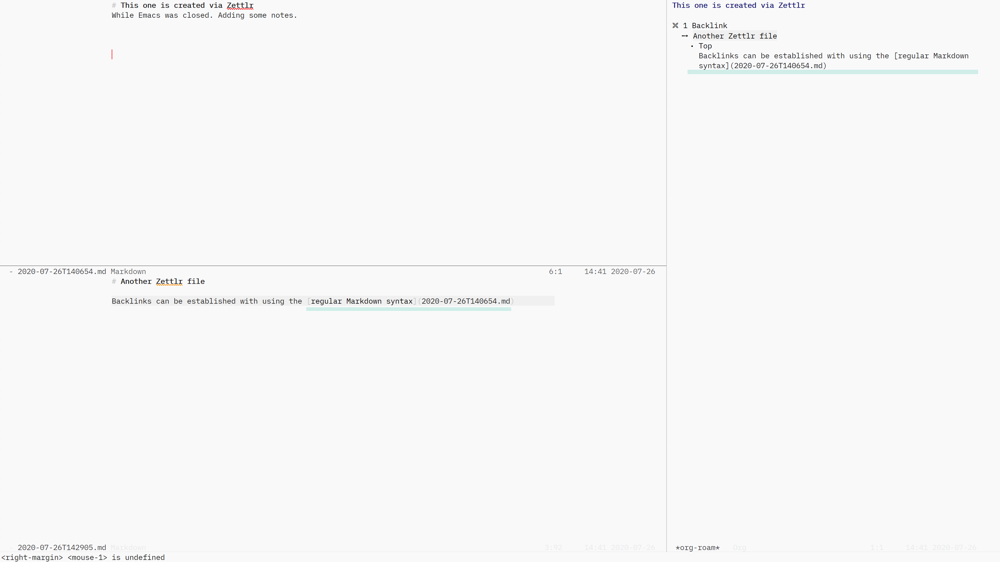

# Backlinks with Markdown standard link syntax

You can now establish backlinks with using the Markdown standard link syntax.

Use the new variable `md-roam-use-markdown-file-links` to control this function.

It is an opt-in customising option, and default is `nil`. Set it to `t` if you would like to use the Markdown link syntax for backlinks. This does not change the [[wiki-link]] behaviour, so you can continue to use it as is. 

Currently, it does not have it's own insert function -- something to consider as a future improvement. 

As Org-roam's backlink buffer (the side panel where backlinks are displayed) uses Org Mode, the Markdown links are displayed as raw text. This UI may have room for improvement. See how a backlink appear in the side panel in the screen shot above.

Despite its appearance, you can click on it to navigate to the linked file from the side panel (Org-roam's behaviour). 
