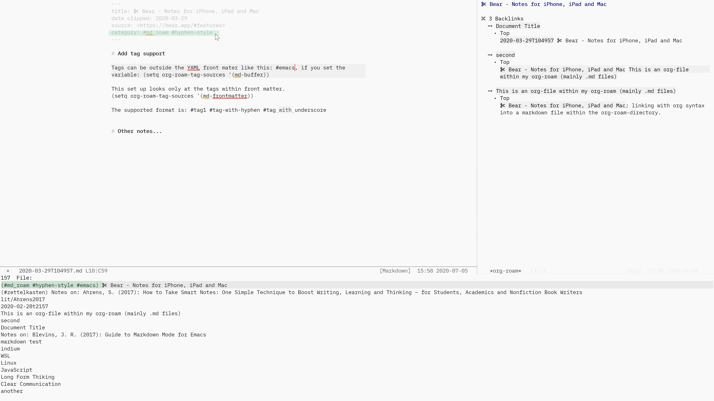
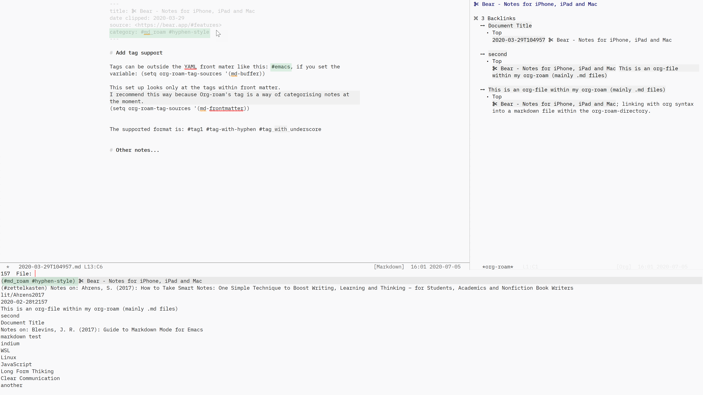
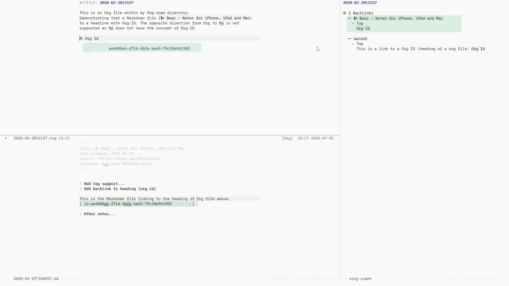

## Change the extraction logic of roam_key (ref-key) to regexp

Add customising option: md-roam-use-org-extract-ref.
It intended to improve performance and aesthetic style.

It is an opt-in customising option, and default is `t`, which is to use `#+ref_key` with Org-roam logic.

If set to `nil`, Md-roam uses its own regexp to look for roam_key: within YAML front matter only. It is backward compatible with #+roam_key if it is defined in the front matter.

Recommended if your bibliographic notes are written in markdown files.
Leave it as default, if they are written in org files."

Test:
- [x] (setq md-roam-use-org-extract-ref t); default
  As expected. Extracts #+roam_key: for bibliographic notes in both Org and Markdown files.
  
- [x] (setq md-roam-use-org-extract-ref nil)
  As expected. Extracts roam_key: within front matter only, and works only for Markdown files.


: Screen shot showing a bibliographic note with `roam_key:` defined within its YAML front matter

## Add support for #tags

Support Org-roam's tag feature. 
The supported formats by default are: #tag1 #tag-with-hyphen #tag\_with\_underscore.

Two functions are added:

- org-roam--extract-tags-md-buffer
- org-roam--extract-tags-md-frontmatter

Edit or add to the list `org-roam-tag-source` variable. For example:

```
(setq org-roam-tag-sources '(md-frontmatter))
```

The `md-frontmatter` function is recommended. This is because the tags in Org-roam currently works as a category, not as a search keyword. See the screen shots below and [the tags section of Org-roam documentation](https://www.orgroam.com/manual/Tags.html#Tags). It should be better for performance compared to the other `md-buffer` function, or Org-roam's standard `prop` function.

The `md-buffer function` is added to support external Markdown editors such as iA Writer in mind, where a tag can be inserted anywhere in the file. 

Test:
- [x] org-roam--extract-tags-md-buffer
- [x] org-roam--extract-tags-md-frontmatter


: Screen shot showing Md-roam stored tags for the entire buffer


: Screen shot showing Md-roam stored tags only within front matter

## Improve performance by disabling Org-ID search for Markdown files

The standard Org-roam behaviour to look for Org-ID for every note in Org-roam directory. including Markdown files. As at the time of writing, this has a significant performance implications [^1] (tested on Windows, but I would assume it would be similar in other OSs). 

[^1]: This can change in the future.

This feature change the adjust the Org-roam's behaviour to look for Org-IDs only for Org files as there is no concept of Org-ID for headings in Markdown files. 

This does not change the behaviour of Org files within Org-roam directory. In additon, since extract is for Org files, you can link to the heading with an Org-ID from a Markdown file. This is demonstrated in the screen shot below.

Test:
- [x] Org-id can be added and used for backlink for org files
- [x] For markdown files, Md-roam ignores extraction of Org-IDs altogether (performance)


: Screen shot showing a markdown file pointing to a heading within an org file

## Add customising option: md-roam-use-org-file-links

Add customising option: md-roam-use-org-file-links.
It is intended to improve performance. 

It is an opt-in customising option, and default is `t`, which is to use the previous behaviour of Markdown -- mixing both [[wikilink]] and [[file:file.ext][description]] link styles for backlinks.

If set to `nil`, Md-roam searches only for [[wikilink]] in Markdown files. This improves performance of startup, especially when you have a large number of notes in Org-roam directory (e.g. more than 1,000). Using regexp to look for links is tested to improve performance (on Windows).

Recommended if you do not have Org files in Org-roam directory.

Setting this variable to `nil` does not affect Org files within Org-roam directory.

Test:
- [x] Markdown file when md-roam-use-org-file-links t
  Expect file link creates a backlink
- [x] Org file when md-roam-use-org-file-links t
  Expect file link creates a backlink
- [x] Markdonwn file. when md-roam-use-org-file-links nil
  Expect file link **does not** create a backlink
- [x]  Org file when md-roam-use-org-file-links nil
  Expect file link creates a backlink
